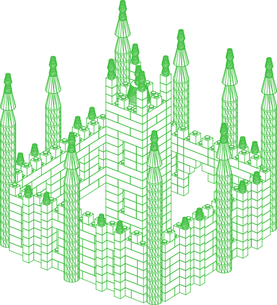
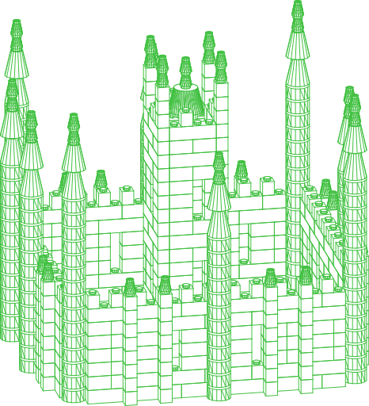

# //pub/examples/lego

Assemblies built from the [LDraw](https://library.ldraw.org) parts library, as
served by `//pub/universe/lego/ldraw`. Nothing is vendored here: this package is
the assemblies, and the geometry is meshed from LDraw's own `.dat` files on
demand.

## castle

A gothic castle: spired towers along the curtain wall and at its corners, a
twin-towered gatehouse over a pointed arch, buttresses with pinnacles between
the bays, and a tall turreted keep.

<table><tr>
<td valign=top><a href="./images/castle-birdseye.png"></a></td>
<td valign=top><a href="./images/castle-front.png"></a></td>
</tr></table>

732 parts, seven distinct LDraw parts between them:

| part | count | |
| --- | --- | --- |
| `Brick:3005` | 271 | 1 x 1 brick |
| `Brick:3004` | 161 | 1 x 2 brick |
| `Brick:3941` | 122 | 1 x 1 round brick |
| `Brick:3010` | 115 | 1 x 4 brick |
| `Cone:4589` | 44 | 1 x 1 cone — the spires |
| `Cone:3942b` | 18 | 2 x 2 cone |
| `Cone:6233` | 1 | 3 x 3 roof cone — the keep |

Everything sits on LEGO's own grid: 8 mm stud pitch, 9.6 mm brick height. The
container carries a single rotation that takes the parts' native Y-up frame into
PartCAD's Z-up world, so `front`, `top`, `right` and `iso` mean what they say.

```shell
pc inspect -a castle
pc render -a -t png --view iso castle
```

### The pieces it is built from

A castle this size repeats itself: four identical corner towers, nine identical
spires, sixteen identical buttresses. So `castle` is not 732 parts in one file -
it is twelve sub-assemblies under `castle/`, placed 48 times between them. Each
one is written once and built once, and every further use of it is a cache hit
rather than a rebuild; 273 parts are described instead of 732.

| sub-assembly | parts | used | |
| --- | --- | --- | --- |
| `castle/buttress` | 9 | 16 | a pier stepping out from the wall, capped with a pinnacle |
| `castle/spire` | 4 | 9 | two 2x2 cones flaring off a tower, then two 1x1 cones to a point |
| `castle/wall` | 65 | 3 | a stretch of curtain wall between two corner towers |
| `castle/wall-gate` | 70 | 1 | the same wall with the gateway's pointed arch corbelled through it |
| `castle/tower-corner` | 15 | 4 | the body of a corner tower |
| `castle/tower-mural` | 12 | 3 | the body of a tower standing along a wall |
| `castle/tower-gate` | 13 | 2 | the body of one of the gatehouse pair |
| `castle/keep-courses` | 14 | 4 | two courses of the keep, the second breaking joint against the first |
| `castle/keep-courses-lancets` | 20 | 2 | two courses of the keep, both cut by a lancet |
| `castle/keep-courses-lancet-head` | 18 | 2 | the two courses a lancet ends in |
| `castle/keep-course-last` | 6 | 1 | the keep's last course, carrying the parapet |
| `castle/keep-head` | 27 | 1 | merlons, a bartizan at each corner, and the spire |

Each is a PartCAD assembly in its own right, so any of them can be looked at,
rendered or built alone:

```shell
pc inspect -a castle/tower-corner
pc render -a -t png --view iso castle/wall
```

The keep is cut into pairs of courses rather than left whole because its
masonry alternates: an even course and the odd one that breaks joint against
it, three kinds of pair covering all of it but the last course and the roof.
The walls are not split further - the gate wall differs from a plain one in
every course, so there is no band of it the two could share.

### Joined, not just placed

A brick placed by coordinates is a brick nothing holds up: the file says where
it ended up, not what puts it there. Most of these bricks say the other thing
instead — which brick they sit on, and which stud of it:

```yaml
- part: //pub/universe/lego/ldraw/Brick:3010
  name: w_c1_0
  connect:
    with: //pub/universe/lego:anti-stud
    withInstance: c0r0
    name: w_c0_0
    to: //pub/universe/lego:stud
    toInstance: c2r0
```

`//pub/universe/lego` declares the pair — a `stud` on top of a part and an
`anti-stud` underneath, one instance per stud, named `c<column>r<row>` in the
part's own grid — and PartCAD works the coordinates out. **188 of the 276 part
nodes** are joined that way. The rest keep coordinates, for three reasons:

* **48 are a unit's first course.** Nothing is under them to stand on; that is
  what makes them the first course.
* **24 are laid across the brick below.** A stud connection can carry a quarter
  turn, and `anti-stud` would need a `turnZ` parameter to say so. The turn
  pivots about the stud, so which anti-stud is named decides where the brick
  lands, and that mapping is not worked out yet.
* **16 are cones whose anti-studs are missing or misplaced.** `Cone 1 x 1`
  (4589) has none — the plugin reads them off the tubes under a part, and a
  1 x 1 cone has no tube — and `Cone 2 x 2 x 2` (3942b) has two of its four,
  both named as the right-hand column. Both sit on studs in reality, so both are
  gaps in `//pub/universe/lego/ldraw` rather than facts about the parts.

A joint through an interface a part has not got is not a joint, and one through
an anti-stud in the wrong place is a joint that lies — so those wait for the
plugin. The model is geometrically identical either way: every one of the 732
parts ends up where it did before, to the last decimal.

### Jinja2, and why every step is still written down

An ASSY file has to enumerate every step. PartCAD reads the tree it makes to
work out the bill of materials, and the assembly instructions are that tree
written out a step to a page, so a step that is not in the file is a step
nobody is told to take.

The *text* need not repeat itself, though: every ASSY file is a Jinja2 template,
rendered before it is parsed. A run of parts laid out regularly is written as
the loop it is -

```yaml

- part: //pub/universe/lego/ldraw/Brick:3941
  name: t_c{{ i }}
  location: [[4.0, {{ (9.6 + i * 9.6) | round(3) }}, 4.0], [0, 1, 0], 0]

```

- and reaches the parser as the fifteen separate nodes it always was. Where
there is no arithmetic to write, because the sixteen buttresses sit wherever
the bays leave room for them, the loop runs over a table of placements instead.
Between them the thirteen files are **321 nodes of YAML for a 732-part model**,
and every one of those 732 parts is still a step of its own.

## A note on interference

Every part here is placed by `location:` rather than joined by `connect:`, and a
LEGO stud is *meant* to occupy the part above it — that interference is what
makes bricks grip. So `partcad.test.interference` has something true to report
about almost every pair in the model, and nowhere to read that it is intended:
an overlap which is meant to be there is stated on the joint that causes it, and
coordinates are not a joint.

Nothing here turns the check off. The package is `manufacturable: false` —
nobody is ordering a castle — and that is what makes interference report what it
finds rather than fail on it. Giving it a threshold high enough to swallow a
stud would be worse than either: that floor is a rounding tolerance, and making
it carry this would be a number pretending to be one.

What would make the check meaningful is the stud / anti-stud mating in
`//pub/universe/lego/ldraw` declaring `snapIn: true` — a stud in an anti-stud is
an interference fit wherever it occurs — and this assembly being generated with
`connect:` so each brick is joined to the one it sits on. Both are worth doing
and neither is done yet.
