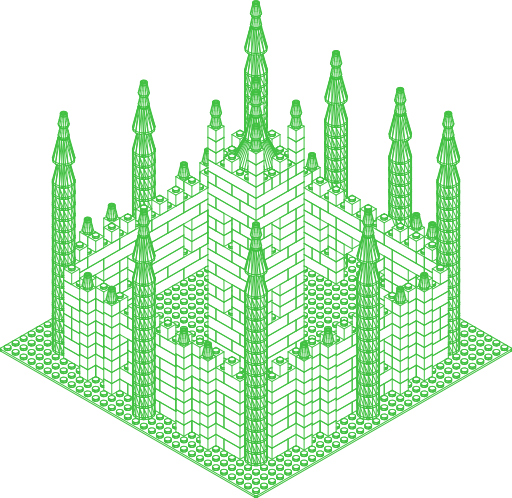
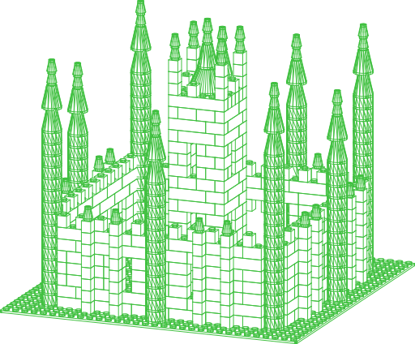
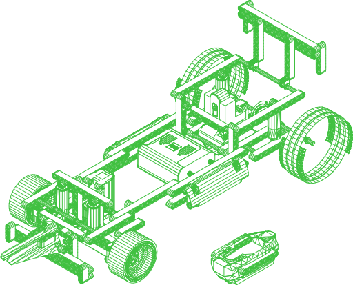
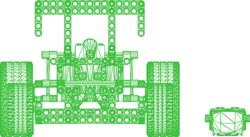
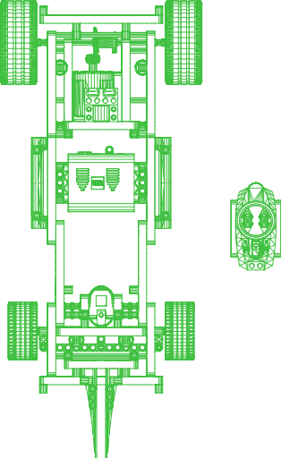

# //pub/examples/lego

Assemblies built from the [LDraw](https://library.ldraw.org) parts library, as
served by `//pub/universe/lego/ldraw`. Nothing is vendored here: this package is
the assemblies, and the geometry is meshed from LDraw's own `.dat` files on
demand.

## castle

A gothic castle: spired towers along the curtain wall and at its corners, a
twin-towered gatehouse over a pointed arch, buttresses with pinnacles between
the bays, and a tall turreted keep.

<table><tr>
<td valign=top><a href="./images/castle-birdseye.png"></a></td>
<td valign=top><a href="./images/castle-front.png"></a></td>
</tr></table>

732 parts, seven distinct LDraw parts between them:

| part | count | |
| --- | --- | --- |
| `Brick:3005` | 271 | 1 x 1 brick |
| `Brick:3004` | 161 | 1 x 2 brick |
| `Brick:3941` | 122 | 1 x 1 round brick |
| `Brick:3010` | 115 | 1 x 4 brick |
| `Cone:4589` | 44 | 1 x 1 cone — the spires |
| `Cone:3942b` | 18 | 2 x 2 cone |
| `Cone:6233` | 1 | 3 x 3 roof cone — the keep |

Everything sits on LEGO's own grid: 8 mm stud pitch, 9.6 mm brick height. The
container carries a single rotation that takes the parts' native Y-up frame into
PartCAD's Z-up world, so `front`, `top`, `right` and `iso` mean what they say.

```shell
pc inspect -a castle
pc render -a -t png --view iso castle
```

### The pieces it is built from

A castle this size repeats itself: four identical corner towers, nine identical
spires, sixteen identical buttresses. So `castle` is not 732 parts in one file -
it is twelve sub-assemblies under `castle/`, placed 48 times between them. Each
one is written once and built once, and every further use of it is a cache hit
rather than a rebuild; 273 parts are described instead of 732.

| sub-assembly | parts | used | |
| --- | --- | --- | --- |
| `castle/buttress` | 9 | 16 | a pier stepping out from the wall, capped with a pinnacle |
| `castle/spire` | 4 | 9 | two 2x2 cones flaring off a tower, then two 1x1 cones to a point |
| `castle/wall` | 65 | 3 | a stretch of curtain wall between two corner towers |
| `castle/wall-gate` | 70 | 1 | the same wall with the gateway's pointed arch corbelled through it |
| `castle/tower-corner` | 15 | 4 | the body of a corner tower |
| `castle/tower-mural` | 12 | 3 | the body of a tower standing along a wall |
| `castle/tower-gate` | 13 | 2 | the body of one of the gatehouse pair |
| `castle/keep-courses` | 14 | 3 | two courses of the keep, the second breaking joint against the first |
| `castle/keep-lancet` | 38 | 2 | four courses: a lancet, and the course that closes it |
| `castle/keep-top` | 47 | 1 | the keep's last three courses, its merlons, four bartizans and the spire |

Each is a PartCAD assembly in its own right, so any of them can be looked at,
rendered or built alone:

```shell
pc inspect -a castle/tower-corner
pc render -a -t png --view iso castle/wall
```

The keep is cut into pairs of courses rather than left whole because its
masonry alternates: an even course and the odd one that breaks joint against
it, three kinds of pair covering all of it but the last course and the roof.
The walls are not split further - the gate wall differs from a plain one in
every course, so there is no band of it the two could share.

### Joined, not just placed

A brick placed by coordinates is a brick nothing holds up: the file says where
it ended up, not what puts it there. Most of these bricks say the other thing
instead — which brick they sit on, and which stud of it:

```yaml
- part: //pub/universe/lego/ldraw/Brick:3010
  name: w_c1_0
  connect:
    with: //pub/universe/lego:anti-stud
    withInstance: c0r0
    name: w_c0_0
    to: //pub/universe/lego:stud
    toInstance: c2r0
```

`//pub/universe/lego` declares the pair — a `stud` on top of a part and an
`anti-stud` underneath — and PartCAD works the coordinates out. **Every one of
the 287 part nodes** is joined that way, in the order they are put together —
there is not a single `location:` left on a part or a piece anywhere in the
model.

Which two ports meet is decided by where they *are*, not by the stud grid the
part's name implies, because for several of these parts the grid is not the
answer: a `Cone 2 x 2 x 2` has four anti-studs under it and a single stud on
top, at its centre, and a `Cone 3 x 3 x 2` has nine and four. A joint picked by
grid index puts such a part half a stud out.

A brick joins downwards to a stud under it *or* upwards into an anti-stud over
it, and that is what keeps the number of coordinates down. A unit's bottom
course does not have to go first: put one brick of it down, add the brick above
that bridges it to its neighbour, and the neighbour then snaps up into that
bridge. So the order is grown rather than given — take whatever can be joined to
what is already down.

Each piece's **first brick says nothing at all** — no coordinates and no joint.
It is the piece's own origin, and where that goes is for whatever places the
piece to decide, so saying it here would be saying it twice.

Getting to none of them took four things beyond the joints themselves, and each
was a fault in the model rather than a limit of the format:

* **The keep's corners did not bond.** Every course laid its four sides the same
  way, so no brick ever spanned a corner and the keep was four stacks that
  merely touched. The corners alternate now.
* **A course over an opening has to reach past it.** A lancet capped by two
  bricks meeting over the hole ties nothing; the capping course is laid
  whichever way puts one brick across the opening with a bearing either side,
  which is not the same way for a four-stud stretch as for a six-stud one. The
  gateway's lintel got the same treatment and now bears a stud into the wall on
  each side.
* **No stretch ends with a single stud.** Three cells laid greedily come out a
  two and a one, and that trailing one sits on the corner with nothing reaching
  across to it.
* **The keep's spire stood on its own open shaft.** It has a floor now — the
  last course laid solid, six bricks the full width, each crossing the ring
  below at both ends — and a spire built the way the towers' are, since a 3 x 3
  cone cannot be centred on a 6 x 6 keep and was sitting half a stud off the
  grid.

### The pieces join each other too, and the whole thing stands on a plate

A piece is placed by coordinates for the same reason a brick was: nothing says
what holds it. So each piece externalizes the ports it is joined by, with `map:`:

```yaml
assemblies:
  castle/spire:
    type: assy
    map:
      spire_s0-anti-c0r0: [spire_s0, //pub/universe/lego:anti-stud, c0r0]
```

A name of the piece's choosing, against the node inside it, the interface that
node implements, and the instance. The interface is not renamed — it is a
contract — but the instance name is the piece's to pick.

The walls, towers and buttresses were the hard case: they all stand on the
ground side by side, and a stud joins what is above to what is below, so edge to
edge there is nothing to join them by. LEGO's own answer is a baseplate, and the
library has one big enough — `Baseplate 32 x 32` (3811), 1024 studs against a
castle covering 30 × 30. Every piece that reaches the ground is joined to it.

So the baseplate says nothing at all: where it goes decides nothing, since every
other node is placed relative to it, and where the castle as a whole sits is the
container's to say.

### The one `location:` left, and why it stays

```yaml
name: castle
location: [[0, 0, 0], [1, 0, 0], 90]   # set the offset to [100.0, -100.0, 0.0] to read coordinates off the stud grid
```

One `location:` in the whole model, on the container, and it is a **turn rather
than a place**. LDraw draws its parts Y-up and PartCAD's world is Z-up: without
it the castle lies on its side, its baseplate standing up like a wall, and
`front`, `top`, `right` and `iso` all mean something else. No joint can derive
that — it is a fact about the parts library, not about the model.

The offset beside the turn is a knob rather than a fact, and it is not free.
Left at zero the castle sits at the origin, which is where the default views
expect to find it. Set to the figure in the comment it stands where the grid
runs on whole studs from a known corner — worth having while reading the numbers
by hand, and it costs the rendered views their framing, because they look from a
fixed point rather than from one relative to the object.

### Jinja2, and why every step is still written down

An ASSY file has to enumerate every step. PartCAD reads the tree it makes to
work out the bill of materials, and the assembly instructions are that tree
written out a step to a page, so a step that is not in the file is a step
nobody is told to take.

The *text* need not repeat itself, though: every ASSY file is a Jinja2 template,
rendered before it is parsed. A run of parts laid out regularly is written as
the loop it is -

```yaml

- part: //pub/universe/lego/ldraw/Brick:3941
  name: t_c{{ i }}
  location: [[4.0, {{ (9.6 + i * 9.6) | round(3) }}, 4.0], [0, 1, 0], 0]

```

- and reaches the parser as the fifteen separate nodes it always was. Where
there is no arithmetic to write, because the sixteen buttresses sit wherever
the bays leave room for them, the loop runs over a table of placements instead.
Between them the thirteen files are **321 nodes of YAML for a 732-part model**,
and every one of those 732 parts is still a step of its own.

## f1

A Formula 1 car in LEGO Technic that drives, steers and rides on springs, with
its Power Functions electrics and the IR remote control beside it.

<table><tr>
<td valign=top><a href="./images/f1-iso.png"></a></td>
<td valign=top><a href="./images/f1-right.png"></a></td>
</tr><tr>
<td valign=top><a href="./images/f1-front.png"></a></td>
<td valign=top><a href="./images/f1-top.png"></a></td>
</tr></table>

| | what does it | how |
| --- | --- | --- |
| drive | `Electric:58121` XL motor | a 12-tooth double bevel (`Technic:32270`) on its output turns the crown of a differential (`Technic:62821`) between two half axles |
| steering | `Electric:99498` servo | stands behind the front axle, output down; an arm on its output pushes a track rod pinned into both knuckles |
| power | `Electric:58119` battery box | across the car between the side frames, pinned into both by the four holes in each of its ends |
| control | `Electric:58123` IR receiver | the airbox, over the motor |
| | `Electric:58122` IR remote control | beside the car |
| front suspension | double wishbones | two `Technic Beam 5` a side; a cross block (`Technic:6536`) on the end of each holds an upright kingpin, and a knuckle (`Technic:32557`) turns on it, carrying the stub axle in a round hole; a shock absorber from the upper wishbone to a crossbeam |
| rear suspension | a swinging subframe | the motor, the differential and both half axles are one subframe, pivoting on an axle across the chassis ahead of the motor and held up by a shock absorber under each of two towers |

211 parts, 31 distinct:

```shell
pc inspect -a f1                # the car and its remote
pc inspect -a f1/car            # the car alone
pc render -a -t png --viewport-origin 10000,-10000,10000 --viewport-up 0,0,1 f1
```

The pictures above are rendered from 10 m away along each axis
(`--viewport-origin 0,-10000,0` for the front, `10000,0,0` for the right side,
`0,0,10000` with `--viewport-up 0,1,0` from above) rather than with `--view`. A
named view is a camera point 100 mm off the origin aimed at the object's centre,
which for a car 44 cm long is close enough to see it from an angle: `--view
right` of this car is not a side view.

It is not small - 44 cm from the back of the rear tyres to the tip of
the nose, 19.5 cm across the rear wheels - and that is what fitting a battery box,
an XL motor, a servo and a receiver takes, with suspension at both ends.

### The pieces it is built from

`f1` is the car and the remote beside it; `f1/car` is the car, and the car is
eleven pieces under `f1/`. Only the sidepod occurs twice - the car is symmetric
but the two front corners are mirror images, and a mirror image is not the same
assembly turned round - so the split is by what the car is made of rather than
by repetition: each piece is a thing that can be built and looked at on its own.

| piece | parts | used | |
| --- | --- | --- | --- |
| `f1/chassis` | 71 | 1 | two side frames of `Technic Beam 15`, the posts and shock towers at the back, the nose rails and the bulkheads the wishbones pivot on |
| `f1/drivetrain` | 34 | 1 | the rear subframe: motor, pinion, differential, half axles, rear wheels and shocks |
| `f1/front-right`, `f1/front-left` | 15 | 1 each | wishbones, kingpin, knuckle, front wheel and shock |
| `f1/front-wing`, `f1/rear-wing` | 16 | 1 each | two slats on edge between two endplates, on two pylons |
| `f1/nose` | 12 | 1 | a cross axle between the nose rails, a crossbeam, and a pair of long fairings as the cone |
| `f1/battery` | 9 | 1 | the battery box and the eight pins that hold it |
| `f1/steering` | 9 | 1 | servo, arm and track rod |
| `f1/airbox` | 3 | 1 | the IR receiver and its pins |
| `f1/sidepod` | 3 | 2 | a smooth panel pinned to the upper side rail |

With the five items that sit in the top files themselves - the pins joining the
tops of the front shocks to their crossbeam and the knuckles to the track rod,
which belong to neither piece they join, and the remote - that is
71 + 34 + 2 x 15 + 2 x 16 + 12 + 9 + 9 + 3 + 2 x 3 + 5 = 211.

### Joined, all of it

**Every part of the car is joined through its ports.** Nothing in `f1/car` is
placed by coordinates: each part names the port of its own and the port of an
earlier part that it is put onto, the way the castle's bricks name the stud they
sit on. The chassis's first beam is the car's origin, and the car's own
`location:` is that beam's pose turned into PartCAD's Z-up world - which is what
puts the ground at z = 0, the nose towards -Y and the car's right towards +X.
(It is also what went wrong first: turning the car into Z-up and nothing else
leaves it lying the way that beam lies.)

The remote control is the one item placed by coordinates, in `f1` beside the
car, because nothing joins a handset to the car it drives. PartCAD's
connectivity check would rightly refuse it among parts that connect, which is
why the car is an assembly of its own.

Which parts need a turn or a push along their axis is what the interfaces allow
and nothing else: a pin turns in a round hole (`turnZ`), an axle slides through
one (`moveZ`), and a stud turns on an anti-stud. An axle hole takes no turn, so a
part on an axle takes whatever roll the axle has - fine for a bush or a wheel,
and not for a cross block, whose pin hole has to be where the design put it. For
those the axle itself is turned, in the round hole it went into.

Two contacts are true of the geometry without being a joint, because no
interface says them: the pinion's mesh with the differential's crown (the crown
has no gear ports, and the pinion's describe a spur mesh, not a bevel one), and
the left half axle's end inside the differential, which is joined to the right
one. The bevel gears inside it, which the two ends would turn, are not
modelled.

### How it was made, and checked

`tools/gen_f1.py` writes every file of the car and the `f1` block of
`partcad.yaml`; nothing under `f1/` is edited by hand. It designs each part at
the pose it should have, then looks for a port of the new part and a port of the
part it goes onto that are at the same point, facing each other, and have
interfaces that mate; that pair becomes the `connect:`. The pose PartCAD will
compute from it - the target port turned around, offset by the joint's
parameters, the part's own port undone - is computed there with the same rule,
and has to come out exactly where the part was designed to be. A part with no
such pair is an error, and the design changes until it has one. The ports come
from `//pub/universe/lego`'s own index, so a joint the package does not serve
cannot be written.

The result was then checked the way the `gen-assembly` skill asks: PartCAD
instantiated `f1`, the tree was walked down to its 211 parts composing every
transform, and each part's world placement was compared with the generator's as a
multiset. All 211 agree, rotations included.

It needed two things from `//pub/universe/lego/ldraw` that it did not have. One
is the axle hole of a cross block: LDraw draws the bush of a cross block as a
primitive with the hole inside it, which the package's geometry walk never
opens, so `Technic:6536`, "Cross Block 1 x 2 (Axle/Pin)", came with its pin hole
and not its axle hole - and every kingpin, nose block and wing mount here is
one. The package reads that primitive now, and 47 parts gained an axle hole. The
other is that one end of an axle may carry several parts: a half axle here
carries two beams, two bushes and a wheel, each joined to its end at its own
`moveZ`, and PartCAD's connectivity test reported them as crowding one port
until `technic-axle` said `multiConnect: true`.

Every piece passes `pc test -f connect`, `connectivity`, `validity`,
`degenerate`, `solidity`, `shell` and `manufacturability` on its own as well as
inside the car.

### What it leaves out

* **The cables.** In the real thing the motor's and the servo's leads go to the
  receiver, and the receiver's to the battery box, routed wherever there is
  room. Nothing about a port says where that is, and none is placed.
* **Travel.** It is a static pose: the wheels straight ahead, the suspension
  settled. The shocks are LDraw's 10L damped shock *compressed* (`76320-f2`),
  whose eyes are six studs apart, so that each one lands on the stud grid.

## A note on interference

A LEGO stud is *meant* to occupy the part above it, and a Technic pin the hole
it is in — that interference is what makes the parts grip. So
`partcad.test.interference` has something true to report about almost every
joint in both models, and nowhere to read that it is intended: an overlap which
is meant to be there is stated on the joint that causes it, and these joints do
not say so.

Nothing here turns the check off. The package is `manufacturable: false` —
nobody is ordering a castle, or this car — and that is what makes interference
report what it finds rather than fail on it. Giving it a threshold high enough to swallow a
stud would be worse than either: that floor is a rounding tolerance, and making
it carry this would be a number pretending to be one.

What would make the check meaningful is the matings in
`//pub/universe/lego/ldraw` declaring `snapIn: true` — a stud in an anti-stud, and a pin or an axle in a hole,
are interference fits wherever they occur. Both models are joined through those
interfaces, so that declaration is all that is missing, and it is not made yet.
